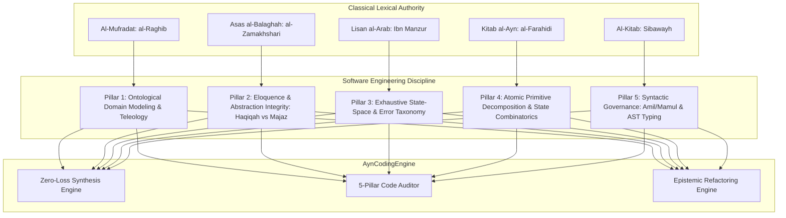

# ⚡ AynEngine AI Coding Edition (`ayncode`)

> **Sovereign 5-Pillar Epistemic Software Engineering Engine Guided by Classical Arabic Lexicography & Grammar**

[](https://www.python.org/)
[](LICENSE)
[](#)

A state-of-the-art software synthesis, code audit, and refactoring engine powered by **DeepSeek** and rigorously grounded in the **5 Classical Arabic Lexicographical and Grammatical Pillars**:
1. **Al-Mufradāt fī Gharīb al-Qurʾān** (Al-Rāghib al-Iṣfahānī, d. 502 AH) — *Ontological Domain Modeling & Teleology*
2. **Asās al-Balāghah** (Al-Zamakhsharī, d. 538 AH) — *Idiomatic Eloquence, Anti-Leakage Abstractions & Minimalism*
3. **Lisān al-ʿArab** (Ibn Manẓūr, d. 711 AH) — *Exhaustive State-Space, Edge-Case Coverage & Error Taxonomy*
4. **Kitāb al-ʿAyn** (Al-Farāhīdī, d. 175 AH) — *Atomic Primitive Decomposition & State Permutations*
5. **Al-Kitāb** (Sībawayh, d. 180 AH) — *Syntactic Governance (ʿĀmil/Maʿmūl), Strict Typing & AST Integrity*

---

## 🏛️ The 5 Pillars of Epistemic Software Engineering



| Pillar | Classical Canon | Software Engineering Invariant |
| :--- | :--- | :--- |
| **1. Teleology & Domain Ontology** | *Al-Mufradāt* (al-Rāghib al-Iṣfahānī) | Pure domain modeling; every entity and routine has an explicit *Ghāyah* (teleological purpose); eliminates generic wrappers (`data`, `manager`, `process`). Distinguishes immutable essence from accidental transient state. |
| **2. Eloquence & Abstraction Integrity** | *Asās al-Balāghah* (al-Zamakhsharī) | Delineates *Ḥaqīqah* (machine runtime reality: CPU, memory, IO, thread context) from *Majāz* (metaphors: ORMs, wrappers, monads). Eradicates leaky abstractions (*Majāz Mukhil*). Maximal *Balāghah* (minimal lines for maximal expressive power). |
| **3. State-Space & Error Taxonomy** | *Lisān al-ʿArab* (Ibn Manẓūr) | Exhaustive morphological coverage. Zero unhandled match arms, unhandled rejections, or silent failures. Models the complete lifecycle: `INITIALIZING` $\to$ `ACTIVE` $\to$ `DEGRADED` $\to$ `CLOSED` $\to$ `FAILED`. |
| **4. Primitive Decomposition & Safety** | *Kitāb al-ʿAyn* (al-Farāhīdī) | Decomposes systems into orthogonal, irreducible primitives. Combinatorial state safety: makes illegal states unrepresentable in the type system. Pure, stateless, idempotent foundations. |
| **5. Syntactic Governance & AST Integrity** | *Al-Kitāb* (Sībawayh) | Strict caller-callee governance (*ʿĀmil wa Maʿmūl*). Clear authority trees, zero circular dependencies, strict static typing, and compile-time AST validation. |

---

## 🚀 Quick Start

### 1. Installation & Environment

Clone the repository and set your DeepSeek API key:

```bash
git clone git@github.com:ihyatafsir/aynengineaicoding.git
cd aynengineaicoding

# Set environment
echo "DEEPSEEK_API_KEY=your_api_key_here" > .env
```

### 2. Running the CLI (`./ayncode`)

The engine provides an interactive CLI at `./ayncode`:

#### Synthesize Code (Zero-Loss Standard)
Synthesizes 100% complete, production-grade code with zero placeholders:
```bash
./ayncode gen "Create an in-memory sliding-window rate limiter with token bucket burst fallback and thread-safe atomicity" -l python -o examples/rate_limiter.py
```

#### 5-Pillar Epistemic Code Audit
Performs an architectural critique of a file or entire codebase:
```bash
./ayncode audit ./examples/rate_limiter.py
```

#### Epistemic Refactoring
Transforms legacy or fragile code to meet 5-Pillar classical standards:
```bash
./ayncode refactor ./legacy_module.py -g "Make illegal states unrepresentable and eliminate leaky abstractions" -i
```

#### Inspect the 5 Classical Pillars
```bash
./ayncode pillars
```

---

## 📁 Repository Architecture

```
aynengineaicoding/
├── ayncode                       # Root symlink to CLI executable
├── bin/
│   └── ayncode                   # Sovereign CLI executable
├── core/
│   ├── code_lexicon_mapper.py    # Bridge mapping code concepts to 5 Classical Lexicas
│   └── coding_engine.py          # Sovereign 5-Pillar Epistemic Engine (DeepSeek)
├── examples/
│   └── rate_limiter.py           # Production rate limiter synthesized via ayncode
├── tests/
│   └── test_coding_engine.py     # Comprehensive unit tests
├── config.py                     # Configuration & lexicon path resolver
├── requirements.txt              # Dependency specifications
├── setup.py                      # Package installer
└── README.md                     # Documentation
```

---

## 🧪 Testing

Run the automated test suite:

```bash
python3 tests/test_coding_engine.py
```

```
.........
----------------------------------------------------------------------
Ran 9 tests in 0.427s

OK
```

---

## 📜 License

MIT License. Designed with classical rigor and epistemological precision.
